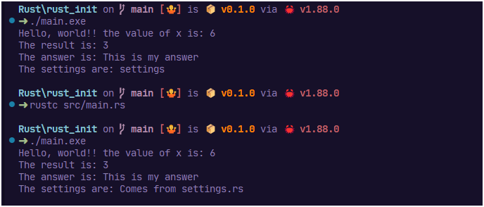
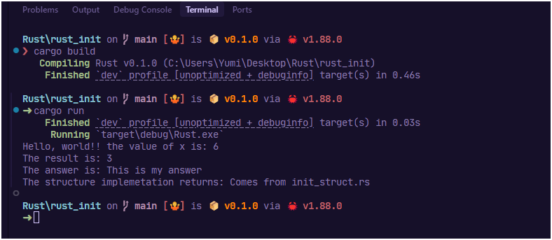

# First Steps in Rust

## Introduction

This repository provides a foundational Rust project structure along with examples demonstrating basic Rust usages.

## Folder structure

```sh
C:\Users\Yumi\Desktop\Rust\rust_init
├── src
|  ├── another_file.rs
|  ├── file_module.rs
|  ├── main.rs
|  └── mod_folder
|     ├── mod.rs
|     └── structure.rs
├── Cargo.lock
├── Cargo.toml
```

## Commands

### Using native `rustc` command

```sh
Rust\rust_init on  main [🤷] is 📦 v0.1.0 via 🦀 v1.88.0 
➜ rustc src/main.rs

Rust\rust_init on  main [🤷] is 📦 v0.1.0 via 🦀 v1.88.0 
➜ ./main.exe
Hello, world!! the value of x is: 6
The result is: 3
The answer is: This is my answer
The settings are: Comes from settings.rs
```



<details>
<summary>More details about native `rustc` command and output </summary>
Rust produces two files in your directory:

1. **main.exe**
    - This is the compiled executable binary. You can run it by typing **`main`** or **`main.exe`** in your terminal or double-clicking it in Explorer.
2. **main.pdb**
    - This is a Program Database (PDB) file, which contains debugging information. Debuggers use this file to map the executable code back to your Rust source code, making it easier to debug your program.

**Summary Table:**

| **File** | **Purpose** |
| --- | --- |
| main.exe | The compiled program you can run |
| main.pdb | Debug info for use with debuggers (optional) |

**Note:**

- The **`.pdb`** file is only generated in debug builds on Windows. If you use **`rustc -C debuginfo=0 main.rs`**, the **`.pdb`** file will not be created.
- When building with Cargo (**`cargo build`**), the output will be in the **`target/debug`** or **`target/release`** directory, and similar files will be generated.

⚠️ You can safely delete the **`.pdb`** file if you don't need to debug the program. The **`.exe`** file is all you need to run your application.
</details>


### Using cargo

```sh
Rust\rust_init on  main [🤷] is 📦 v0.1.0 via 🦀 v1.88.0 
❯ cargo build
   Compiling Rust v0.1.0 (C:\Users\Yumi\Desktop\Rust\rust_init)
    Finished `dev` profile [unoptimized + debuginfo] target(s) in 0.46s

Rust\rust_init on  main [🤷] is 📦 v0.1.0 via 🦀 v1.88.0 
➜ cargo run
    Finished `dev` profile [unoptimized + debuginfo] target(s) in 0.03s
     Running `target\debug\Rust.exe`
Hello, world!! the value of x is: 6
The result is: 3
The answer is: This is my answer
The structure implemetation returns: Comes from init_struct.rs
```



<details>
<summary>More details about `cargo` command and output </summary>
**Cargo** is Rust’s official package manager and build system, designed to streamline and automate the development process for Rust projects. It handles several essential tasks:

- **Dependency Management:** Cargo automatically downloads, compiles, and manages external libraries (called *crates*) required by your project.
- **Building Projects:** It compiles your code along with all dependencies, ensuring compatibility and up-to-date builds.
- **Running and Testing:** Cargo provides simple commands to build, run, and test your applications, making the development workflow efficient.
- **Documentation Generation:** It can generate documentation for your project and its dependencies.
- **Packaging and Publishing:** Cargo allows you to package your libraries or applications and publish them to crates.io, Rust’s central package registry.

Cargo is included with the standard Rust installation. It expects a specific project structure, typically with a **`src`** directory for source code and a **`Cargo.toml`** file for project configuration and dependency specification.

Cargo is an integral tool for Rust developers, simplifying project management, dependency handling, and code distribution.
</details>